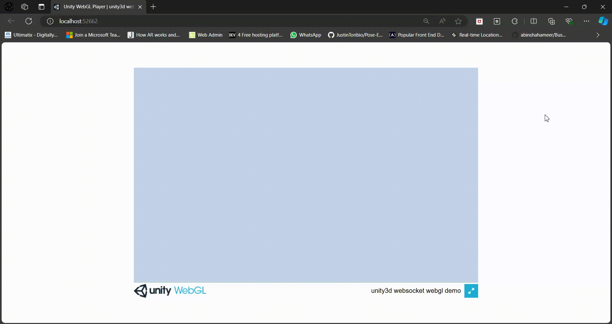

# unity3d websocket webgl demo

Hybrid event-driven WebSocket implementation for Unity 3D.

It automatically compiles browser or native implementation based on project's target platform. Native implementation is using [WebSocketSharp](https://github.com/sta/websocket-sharp) library (must be downloaded separately - see below). For the browser implementation the custom emscripten JSLIB is used.



## Usage

For example usage see `Scripts/WebSocketDemo.cs` file. You can import it to your project and assign it to any GameObject. Then run your project and check the console.

```csharp
using System.Collections;
using System.Collections.Generic;
using System.Text;
using UnityEngine;
using UnityEngine.UI;

// Use plugin namespace
using HybridWebSocket;

public class WebSocketDemo : MonoBehaviour
{
    string message = "";
    Text info;
    WebSocket ws;

    // Use this for initialization
    void Start()
    {
        info = GameObject.Find("Info").gameObject.GetComponent<Text>();

        // Create WebSocket instance
        ws = WebSocketFactory.CreateInstance("ws://localhost:8080");

        // Add OnOpen event listener
        ws.OnOpen += () =>
        {
            Debug.Log("WS connected!");
            Debug.Log("WS state: " + ws.GetState().ToString());
            message += "WS connected!\nWS state: " + ws.GetState().ToString() + "\n";

            ws.Send(Encoding.UTF8.GetBytes("Hello from Unity 3D!"));
        };

        // Add OnMessage event listener
        ws.OnMessage += (byte[] msg) =>
        {
            Debug.Log("WS received message: " + Encoding.UTF8.GetString(msg));
            message += "WS received message: " + Encoding.UTF8.GetString(msg) + "\n";
        };

        // Add OnError event listener
        ws.OnError += (string errMsg) =>
        {
            Debug.Log("WS error: " + errMsg);
            message += "WS error: " + errMsg;
        };

        // Add OnClose event listener
        ws.OnClose += (WebSocketCloseCode code) =>
        {
            Debug.Log("WS closed with code: " + code.ToString());
            message += "WS closed with code: " + code.ToString();
        };

        // Connect to the server
        ws.Connect();
    }

    // Update is called once per frame
    void Update()
    {
        info.text = message;
    }

    void OnApplicationQuit()
    {
        ws.Close();
    }
}
```